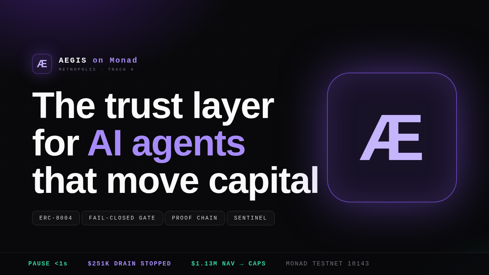

# ÆGIS on Monad



**The trust layer for AI agents that move capital.**
Metropolis Hackathon · Track 4 — Trust, Identity & AI Infrastructure ($30,000 pool).

## 🔴 Live demo

**▶ https://preview-c-6aad749e-14810412-7397ac081f6b.space-z.ai/**

No setup, no keys — open it and drive the full prototype: run the multi-agent trading desk, import any wallet (ENS or 0x) live from Zerion and watch the CHP caps recalibrate, verify the HMAC proof chain, and fire the Sentinel drills (including the hostile prompt-injection drill where the desk locks itself before a human can react).

## 🎬 3-minute demo video


*Direct file: [`media/demo/aegis-demo.mp4`](media/demo/aegis-demo.mp4) — full walkthrough: multi-agent trading desk → LLM council → fail-closed CHP gate → Zerion live-NAV cap recalibration → HMAC proof ledger anchored on Monad → Sentinel autonomous circuit-breaker drills.*

Aegis is a working prototype of the missing infrastructure between "an AI agent decided to trade" and "money actually moved on Monad". Agents are registered identities, every capital-moving action passes a deterministic fail-closed policy gate, every decision is hashed into an HMAC-chained proof ledger anchored to Monad, and a sentinel watcher swarm can lock the whole desk autonomously — faster than a human can react — when exploit-shaped behavior appears.

## Live demo walkthrough (2 minutes)

*Open the [live demo](https://preview-c-6aad749e-14810412-7397ac081f6b.space-z.ai/) and follow along:*

1. **Overview** — desk telemetry: NAV, verdict mix, anchors, exploit-$ stopped.
2. **Trading Desk** — three signal agents propose trades; large ones go to a 3-seat LLM council; everything flows through the gate → simulation → broadcast loop. Watch the live event feed.
3. **Policy Gate** — the CHP v1.0 kernel, ten rules, fail-closed. Tune caps live, watch verdicts and full evaluation traces. HITL inbox for human escalations.
4. **Treasury · Zerion** — import ANY wallet (ENS or 0x) live from the Zerion API. The imported NAV **recalibrates the CHP dollar caps** (per-trade 2% NAV, council > 1% NAV, daily 8% NAV) and opens a fresh policy epoch. Monad exposure is highlighted natively.
5. **Proof Ledger** — every decision (passes *and* blocks) is HMAC-chain-sealed; batched anchor roots are "sealed on Monad". VERIFY CHAIN recomputes the full chain + all anchor roots in the browser.
6. **Sentinel** — run the three drills:
   - *Treasury drain (rogue agent)* → allowlist + velocity BLOCK, OSINT-confirmed, circuit breaker LOCKS the desk autonomously.
   - *Flash-loan shaped arb (benign)* → ANOMALY fires, OSINT cross-check stands down. No false-positive downtime.
   - *Hostile prompt injection* → PATTERN watcher catches it, breaker pauses, rogue agent frozen.
   Resume requires the human key (HITL).
7. **Registry** — live ERC-8004 agent registry (register, pause, freeze, reputation, stake).
8. **Contracts** — the actual Solidity: `AegisRegistry` (ERC-8004), `AegisAnchor` (decision-hash root anchoring), `AegisBreaker` (on-chain circuit breaker) — ready for Monad mainnet deployment.

## Architecture

```
 signals ─┐                                   ┌─ anchors → Monad (AegisAnchor)
          ├─► LLM council ─► CHP v1.0 GATE ───┤
 agents ──┘   (3 seats)     │  fail-closed   └─ broadcast → Monad testnet
                            │
        ERC-8004 identity ──┤── HMAC proof ledger (AegisAnchor roots)
                            │
   Zerion live NAV ──► cap derivation (2% / 1% / 8% of real AUM)
                            │
   Sentinel watchers ───────┴─► autonomous circuit breaker (AegisBreaker)
```

Four layers, one product:

| Layer | What it does | Where |
|---|---|---|
| **Identity** | ERC-8004 agent registry — who is allowed to act | `src/lib/aegis/contracts.ts` · Registry tab |
| **Gate** | CHP v1.0 deterministic fail-closed policy engine (10 rules) + LLM council for large moves | `src/lib/aegis/gate.ts` · `council.ts` · Gate tab |
| **Proof** | HMAC-SHA256 chained ledger, batched anchor roots sealed on-chain | `src/lib/aegis/ledger.ts` · Ledger tab |
| **Sentinel** | Watcher swarm + OSINT cross-check + autonomous circuit breaker | `src/lib/aegis/sentinel.ts` · Sentinel tab |

## Stack (100% open source)

- **Next.js 16** + React 19 + Tailwind 4 — control-room UI
- **socket.io** mini-service (`:3003`) — authoritative engine + realtime bus
- **bun** — engine runtime
- **z-ai-web-dev-sdk** — 3-seat LLM council (graceful heuristic fallback under rate limits)
- **Zerion v1 API** — live portfolio context (Basic auth; key stays server-side)
- **Public Monad RPC rotator** (`testnet-rpc.monad.xyz` + Ankr) — no QuickNode
- **Anvil/Foundry-style fork pre-flight simulation** — no Tenderly

## Quickstart

```bash
# 1. deps
bun install            # or: npm install

# 2. env (optional — demo runs in mirror mode without it)
cp .env.example .env   # then set ZERION_API_KEY for live treasury import

# 3. run the engine (terminal 1)
cd mini-services/aegis-engine && bun index.ts     # socket.io on :3003

# 4. run the UI (terminal 2)
bun run dev                                        # Next.js on :3000
```

Open `http://localhost:3000`, go to **Treasury · Zerion**, paste any wallet (try `vitalik.eth`), hit **LOAD LIVE PORTFOLIO**, then run a Sentinel drill.

> In production Caddy fronts both (see `Caddyfile`): `/` → :3000, and socket.io
> is routed via `?XTransformPort=3003`.

## Environment

| Var | Required | Purpose |
|---|---|---|
| `ZERION_API_KEY` | no | Live wallet portfolio import (Treasury tab + cap derivation). Without it the desk runs in mirror mode on simulated NAV. Get one at dev.zerion.io |
| `DATABASE_URL` | no | Prisma placeholder (not used by the demo engine) |

**Never commit `.env`.** The Zerion key is read only inside the engine process and never shipped to the browser.

## The CHP v1.0 gate — ten rules, fail-closed

| # | Rule | Outcome on fail |
|---|---|---|
| R0 | Sentinel circuit breaker disengaged | LOCKED |
| R1 | ERC-8004 identity registered + ACTIVE | BLOCKED |
| R2 | Asset on allowlist | BLOCKED |
| R3 | Notional ≤ per-trade cap (2% live NAV) | HITL_REQUIRED |
| R4 | Daily notional ≤ cap (8% live NAV) | BLOCKED |
| R5 | Velocity ≤ max/min per agent | BLOCKED |
| R6 | Confidence ≥ floor | BLOCKED |
| R7 | Post-trade concentration ≤ max | HITL_REQUIRED |
| R8 | LLM council APPROVE recorded (for > 1% NAV) | BLOCKED |
| R9 | Pre-broadcast simulation passes | fail-closed, never broadcast |

Anything the gate cannot evaluate cleanly resolves **against** the caller.

## Repo layout

```
mini-services/aegis-engine/index.ts   # authoritative engine + socket.io bus (:3003)
src/lib/aegis/                        # shared engine libs (imported by engine AND UI)
  types.ts gate.ts ledger.ts sentinel.ts council.ts market.ts zerion.ts contracts.ts
src/components/aegis/                 # one tab, one component
src/app/page.tsx                      # single-page control room
scripts/test-*.ts                     # engine smoke tests (bun)
contracts source (in-app)             # AegisRegistry / AegisAnchor / AegisBreaker
```

## Notes

- The demo simulates the Monad testnet loop (blocks, broadcasts, anchor txs) in-process so the full story is demonstrable offline; the contracts in the **Contracts** tab are the real deployment targets on Monad mainnet.
- Signal agents, prices and PnL are simulated; the treasury portfolio, caps, council and every gate/ledger behavior are real.
- Built for judges who click things: every claim on the Overview tab has a tab where you can verify it.
